# PSHELL

Primitive Datatype

Task 1

Use “Get-Help” to find out more information about 5

cmdlets.

As an example you can use “Get-Service” or “Out-GridView”

Notes:

Get-Help Get-Help

Get-Help New-Item

Get-Help Get-Alias

Get-Help Get-AuthenticodeSignature

Get-Help Get-ControlPanelItem

\# Although any 5 cmdlets will do

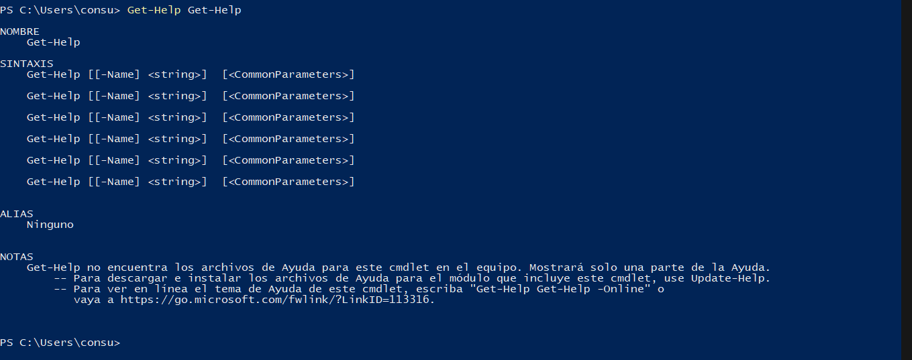

No me permite actualizar la ayuda (estoy en Windows10)

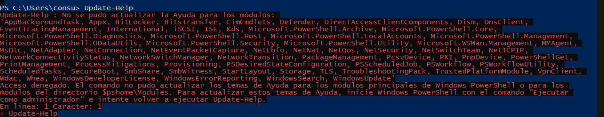

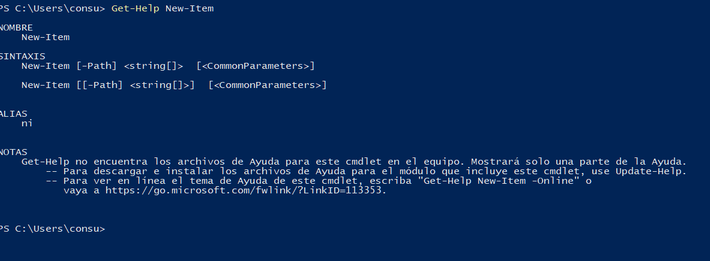

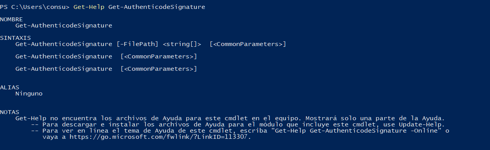

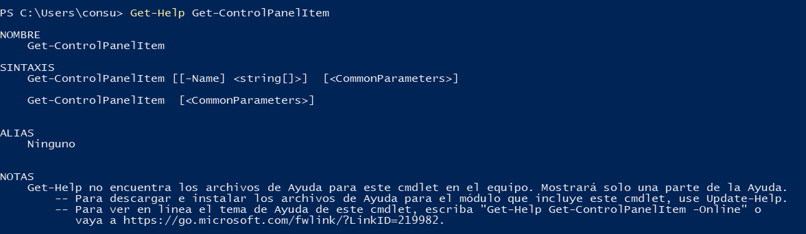

Task 2

Use “Get-Help” with the “–Example” parameter for the

5 cmdlets you discovered more about in task 1.

Notes:

Get-Help Get-Help -Examples

Get-Help New-Item -Examples

Get-Help Get-Alias -Examples

Get-Help Get-AuthenticodeSignature -Examples

Get-Help Get-ControlPanelItem -Examples

\# Although any 5 cmdlets will do

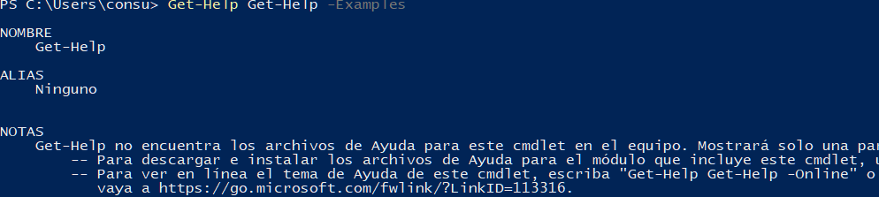

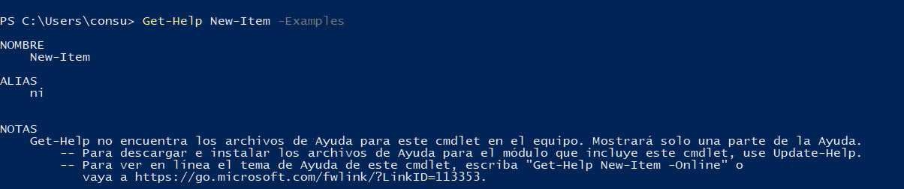

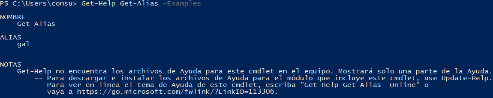

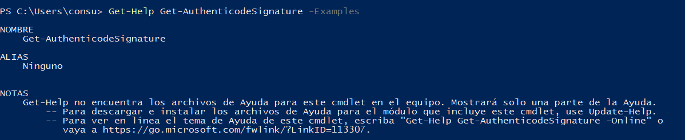

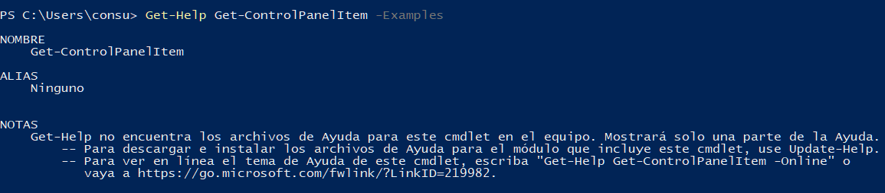

Task 3

Create a new text file named “TestFile.txt” under C:\\

Maximo\\PowerShell\\Workshop1\\%USERNAME%

The cmdlet to make a file and a new directory starts with “New”

Notes:

New-Item -Path C:\\ -Name Expo -ItemType Directory

New-Item -Path C:\\Sudoblark -Name PowerShell -ItemType Directory

New-Item -Path C:\\Sudoblark\\PowerShell -Name Workshop1 -ItemType Directory

New-Item -Path C:\\Sudoblark\\PowerShell\\Workshop1 -Name bclark -ItemType Directory

New-Item -Path C:\\Sudoblark\\PowerShell\\Workshop1\\bclark\\ -Name Testfile.txt -ItemType File

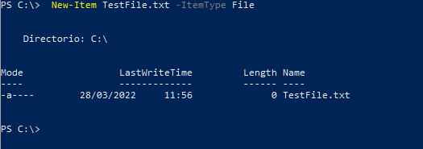

Task 4

Populate the text file you created in task 3 with all

three datatypes we’ve covered: “Boolean”, “String”

and “Int”

The cmdlet you need starts with “Add”

Notes:

Add-Content -Path C:\\Sudoblark\\PowerShell\\Workshop1\\bclark\\Testfile.txt -Value True

Add-Content -Path C:\\Sudoblark\\PowerShell\\Workshop1\\bclark\\Testfile.txt -Value "Hello"

Add-Content -Path C:\\Sudoblark\\PowerShell\\Workshop1\\bclark\\Testfile.txt -Value 42

Task 5

Read from the text file and use “Get-Member” to find

the datatype returned

The cmdlet you need to read data from the text file begins to “Get”

Notes:

Get-Content -Path C:\\Sudoblark\\PowerShell\\Workshop1\\bclark\\Testfile.txt | Get-Member

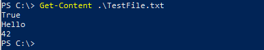

Task 6

Overwrite all data within the text file that you created

in task 3.

The cmdlet you need starts with “Set”

Notes:

Set-Content -Path C:\\Sudoblark\\PowerShell\\Workshop1\\bclark\\Testfile.txt -Value "Boooooo"

Task 7

Format the data returned by a cmdlet into a list

You will need to pipe the original cmdlet then use the “Format-List”

cmdlet

Notes:

Get-Service | Format-List

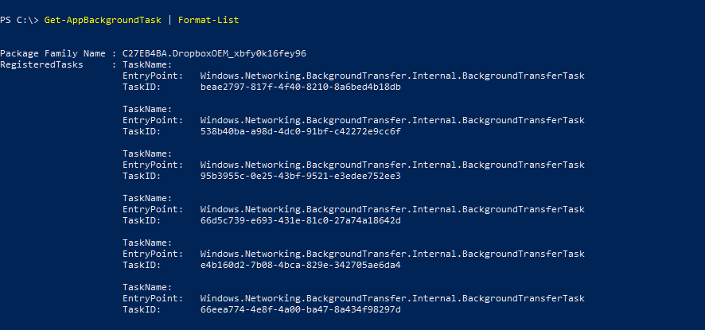

Task 8

Pipe “Get-Command” into “Out-GridView”

Notes:

Get-Command | Out-GridView

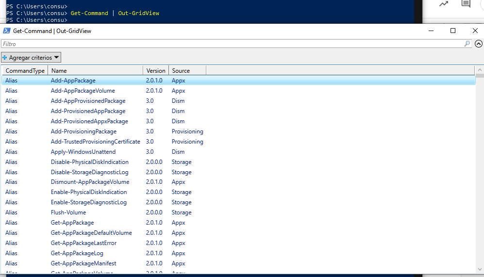

Task 9

Pipe the 5 cmdlets you discovered in task 1 into “Out-

GridView”

Notes:

Get-Help | Out-GridView

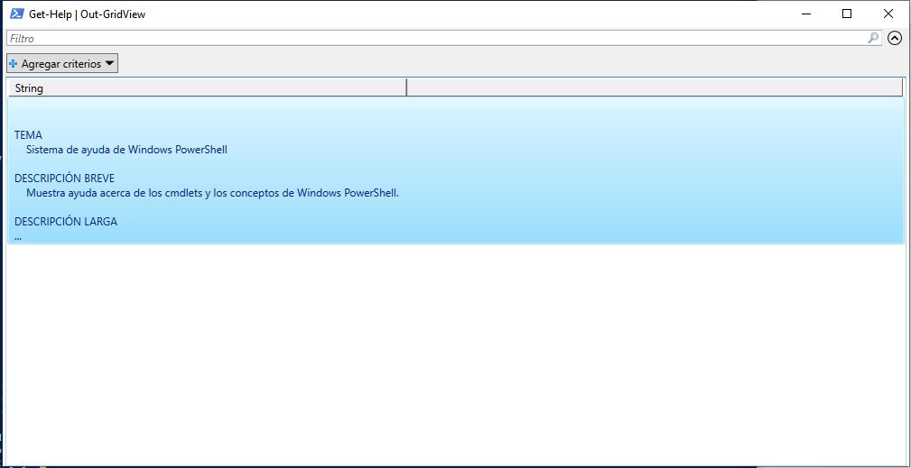

New-Item | Out-GridView

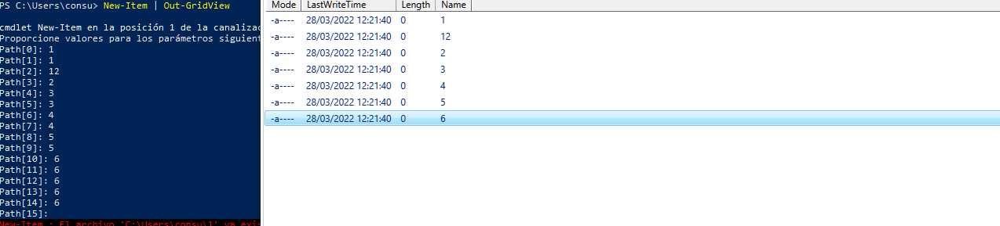

Get-Alias | Out-GridView

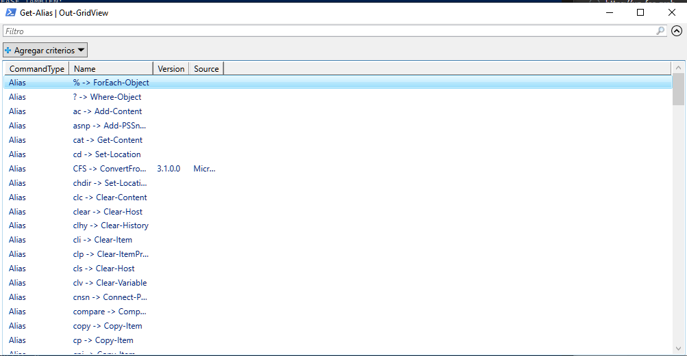

Get-AuthenticodeSignature | Out-GridView

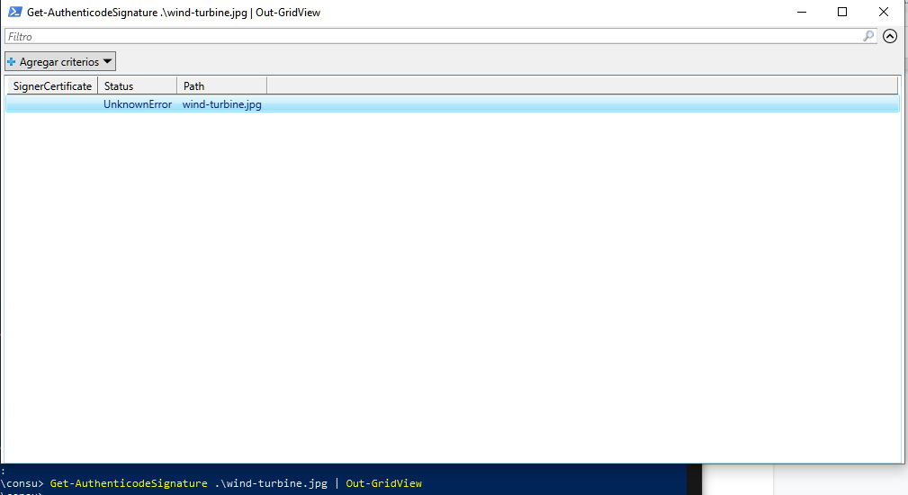

Get-ControlPanelItem | Out-GridView

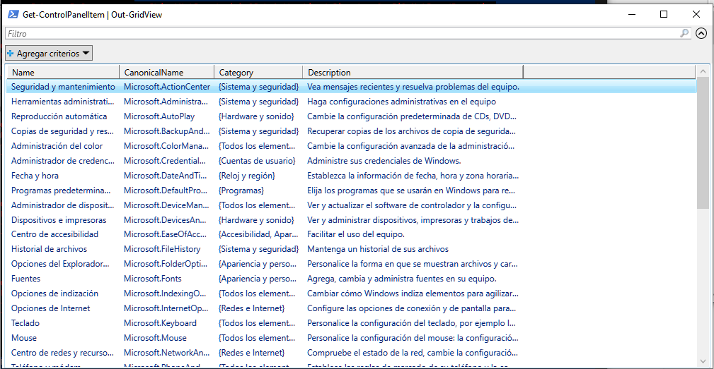

Task 10

Find the official PowerShell documentation library from

Microsoft

Google MSDN PowerShell. The URL starts with

“https://docs.microsoft.com”

[https://docs.microsoft.com/en-us/powershell/](https://www.google.com/url?q=https://docs.microsoft.com/en-us/powershell/&sa=D&source=editors&ust=1648466811329471&usg=AOvVaw0ZWfK72Mlt44ZAnwt478Sd)
